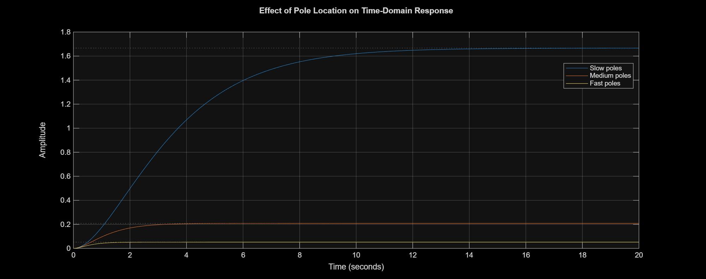
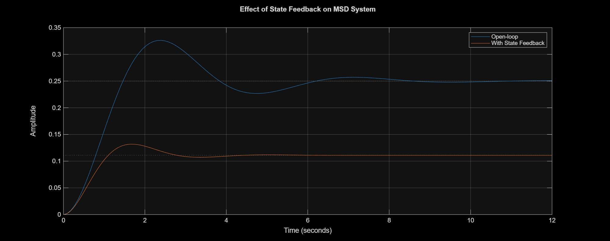

# Mass-Spring-Damper Control System

## 📌 Problem

The mass-spring-damper system is a second-order dynamic system that exhibits oscillatory behavior and sensitivity to disturbances.

The objective of this project is to:
- Analyze system dynamics  
- Improve stability  
- Reduce overshoot  
- Achieve faster settling  
- Handle disturbances effectively  

using multiple control strategies.

---

## 🧠 System Overview

The system is governed by:

m x'' + c x' + k x = F(t)

Where:
- m → mass  
- c → damping coefficient  
- k → spring constant  

The plant is modeled as a transfer function and reused across all control strategies.

---

## 🧩 System Architecture

All simulations use a common plant model:

model/plant_definition.m

This file defines:
- System parameters (m, c, k)  
- Transfer function G(s)  

### 🔁 Modular Design

Each control method:
1. Loads the plant model  
2. Designs its own controller  
3. Simulates system response  

Example:
in matlab  
run('../model/plant_definition.m');  
---
📂 Project Structure

mass_spring_damper_control/

├── model/
├── System_implementation/
├── State_space_analysis/
├── State_feedback_control/
├── Pole_placement/
├── results/

👉 Each folder represents a different control strategy.
---

## 📷 Results & Analysis

### 🔹 Open Loop Response

  

- Overshoot ≈ 30%  
- Oscillatory response  
- Slow settling time  

👉 The system is underdamped and unsuitable for controlled applications.

---

### 🔹 Closed Loop (PID Control)

  

- Reduced oscillations  
- Faster settling time  
- Handles disturbance effectively  

👉 Feedback control stabilizes the system and improves disturbance rejection.

---

### 🔹 Pole Placement Control

  

- Controlled overshoot  
- Faster response compared to open loop  

👉 System poles directly influence transient response characteristics.

---

### 🔹 State Feedback Control

  

- Improved stability  
- Better dynamic response  

👉 Full-state feedback allows precise shaping of system behavior.

---

## 📊 Comparison Summary

| Method            | Stability | Response Speed | Overshoot | Disturbance Handling |
|------------------|----------|---------------|-----------|----------------------|
| Open Loop        | Poor     | Slow          | High      | None                 |
| PID Control      | Good     | Faster        | Low       | Good                 |
| Pole Placement   | Good     | Fast          | Medium    | Moderate             |
| State Feedback   | Good     | Fast          | Low       | Good                 |

---

## 📈 Key Engineering Insights

- Open-loop systems are highly sensitive to disturbances and lack stability  
- Feedback significantly improves system performance and robustness  
- PID control is effective for practical implementation  
- Pole placement provides direct control over system dynamics  
- State feedback enables precise tuning but requires full system states  

---

## 🛠 Tools Used

- MATLAB  
- Control System Toolbox  

---

## 🎯 Conclusion

Feedback control transforms an oscillatory system into a stable and controllable one.  
Different control strategies provide trade-offs between performance, complexity, and implementation requirements.

Choosing the right method depends on system constraints and desired performance.
