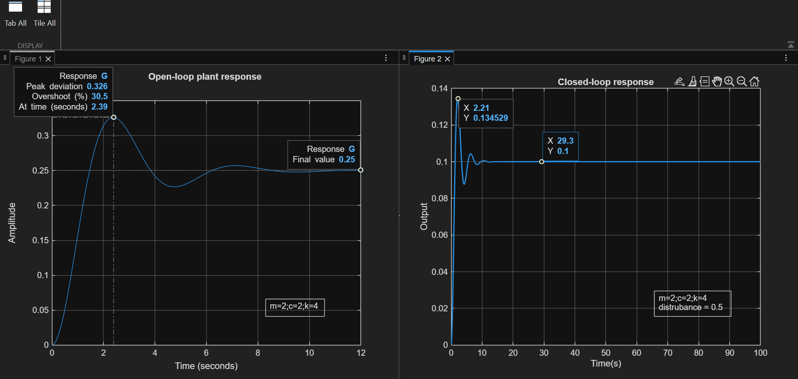
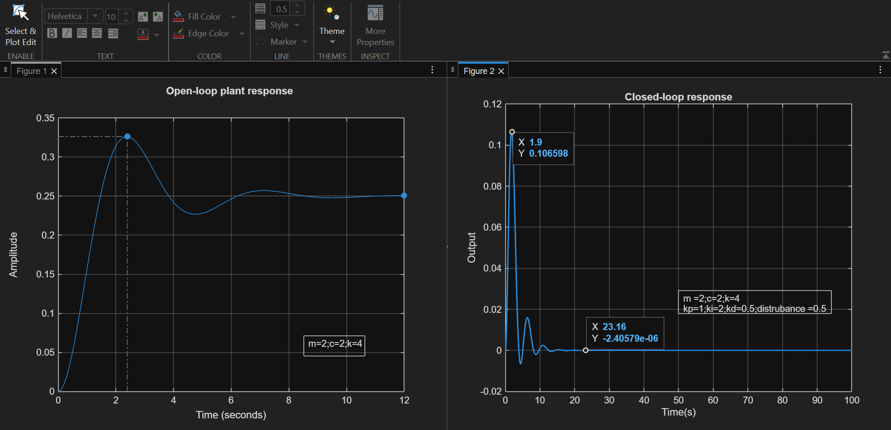

# Mass-Spring-Damper Control System

## 📌 Problem

Design and analyze control strategies for a mass-spring-damper system.

---

## 🧠 Approaches Implemented

### 1. State Space Analysis

* System modeled in state-space form
* Studied system dynamics and stability

### 2. State Feedback Control

* Designed controller using feedback
* Improved stability and response

### 3. Pole Placement Control

* Adjusted system poles to control response
* Reduced overshoot and settling time

---

## 📊 Results Comparison

| Method         | Stability | Response Speed | Overshoot |
| -------------- | --------- | -------------- | --------- |
| Open Loop      | Poor      | Slow           | High      |
| State Feedback | Good      | Faster         | Medium    |
| Pole Placement | Best      | Fast           | Low       |

---

## 📈 Key Insight

Feedback control significantly improves system stability and performance.
Different methods provide trade-offs between speed, accuracy, and control effort.

---
## outputs
OPEN LOOP

Closed Loop

---

## 🛠 Tools Used

* MATLAB
* Control System Toolbox

---

## 🎯 Conclusion

This project demonstrates how different control strategies affect system behavior and how to choose appropriate methods based on system requirements.

